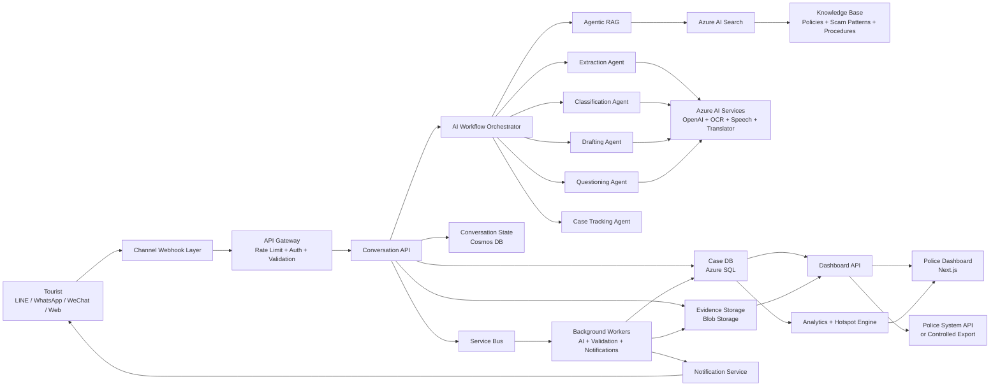
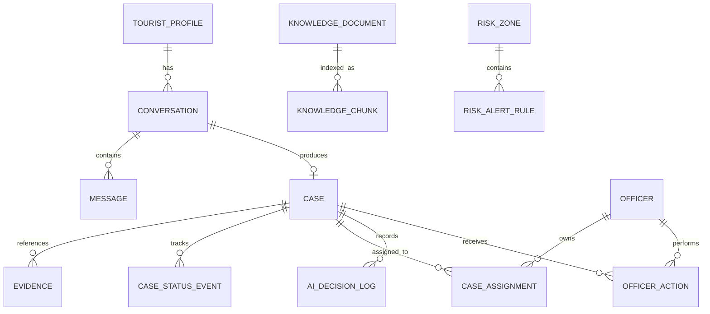
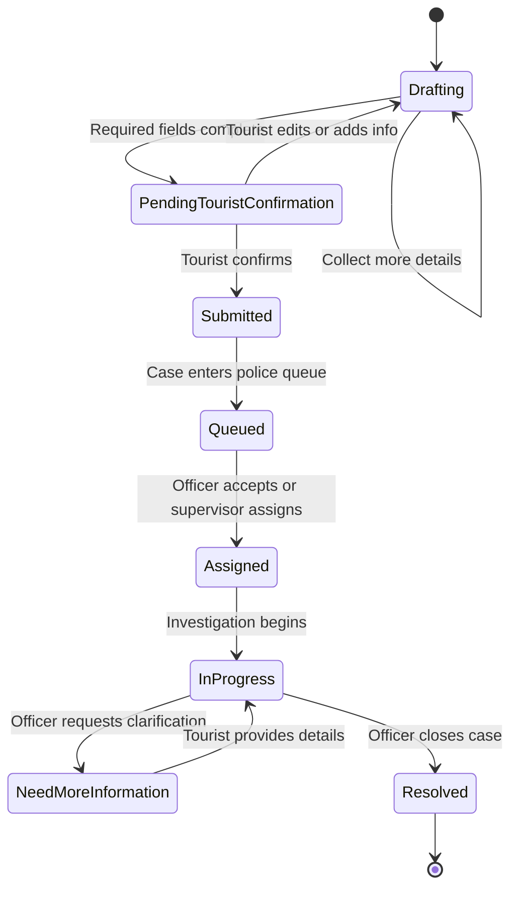
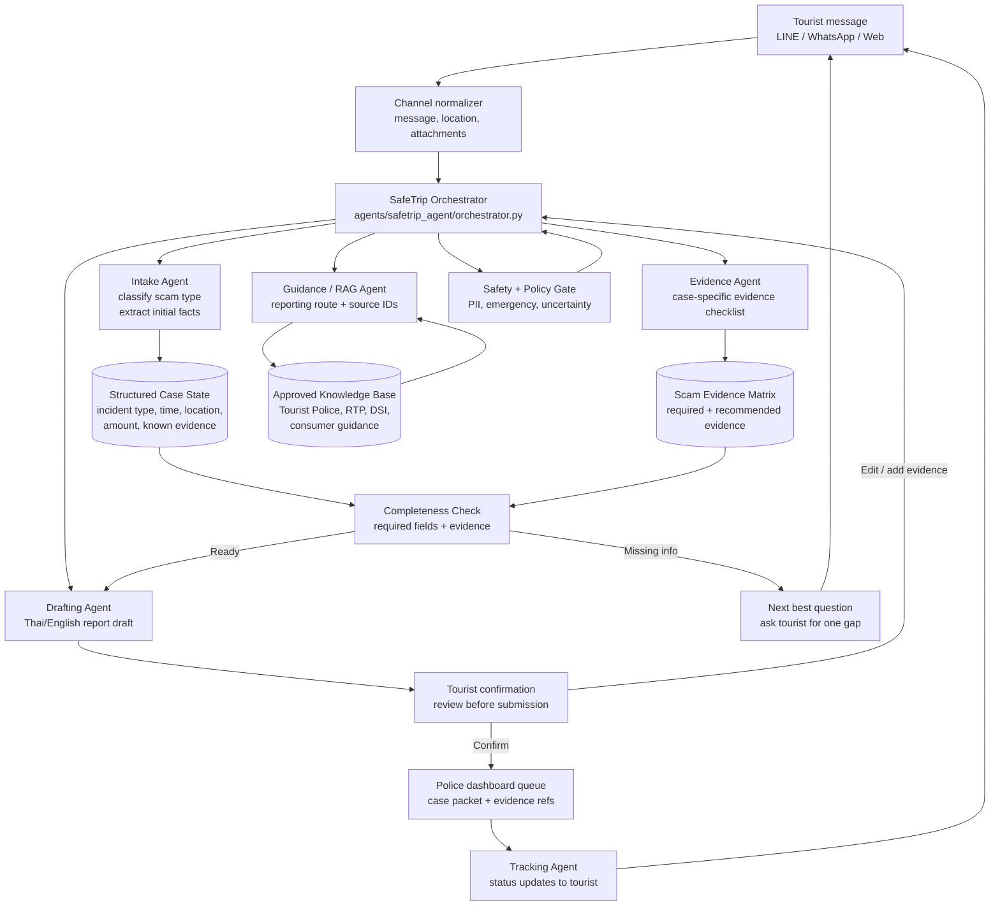
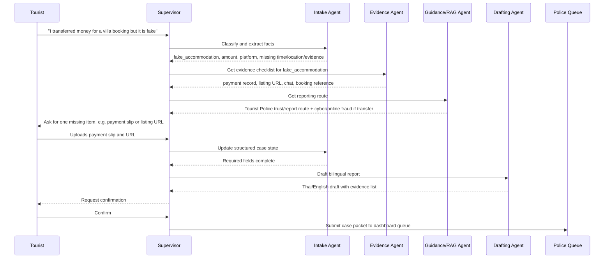

# SafeTrip AI Technical Architecture

**Project:** SafeTrip AI  
**Purpose:** A location-aware, multilingual AI safety assistant for tourists in Thailand.  
**Document type:** Deep technical architecture and implementation stack blueprint.  
**Status:** Design blueprint for prototype, MVP, and production rollout.

---

## 1. Executive Technical Summary

SafeTrip AI should be designed as an incident-intake and tourist-safety platform, not only as a chatbot. The system has three primary jobs:

1. Warn tourists about nearby risk patterns before an incident happens.
2. Guide tourists through evidence collection and next steps when something happens.
3. Convert unstructured tourist messages into structured, reviewable police case records.

The recommended architecture is a cloud-native, event-driven system built around:

- Messaging channels such as LINE, WhatsApp, WeChat, and web chat.
- A backend API layer for conversation, case, evidence, notification, and dashboard operations.
- An agentic AI orchestration layer for questioning, retrieval, extraction, classification, drafting, translation, and tracking.
- A secure data layer for cases, evidence, audit logs, location risk data, and knowledge base content.
- A police dashboard for triage, assignment, status updates, and hotspot analytics.
- Strong governance controls for privacy, retention, AI safety, access control, and auditability.

Because the original project concept is Azure-centered, the recommended production stack uses Azure services where they are the natural fit. The same architecture can be adapted to AWS, GCP, or a self-hosted stack, but Azure is the most direct match for the report.

---

## 2. Core System Requirements

### 2.1 Functional Requirements

| Area | Requirement |
|---|---|
| Tourist channels | Support tourist communication through LINE first, then WhatsApp, WeChat, and web chat. |
| Multilingual support | Detect language, translate tourist input, and generate Thai/English case summaries. |
| Location-aware alerts | Trigger area-specific warnings based on tourist location and known incident patterns. |
| Guided incident intake | Ask dynamic follow-up questions until required case fields are complete. |
| Evidence handling | Accept images, receipts, screenshots, audio, text, map locations, and optional contact data. |
| AI extraction | Extract incident type, location, timestamp, amount lost, involved parties, and evidence references. |
| AI classification | Classify case category, severity, urgency, and readiness for submission. |
| Report drafting | Generate officer-ready Thai and English incident drafts for user confirmation. |
| Tourist confirmation | Require explicit user approval before submitting a formal report. |
| Police dashboard | Provide queue, filters, case detail, evidence review, assignment, status updates, and metrics. |
| Case tracking | Notify tourists when case status changes or more information is needed. |
| Hotspot analytics | Aggregate cases by location, incident type, severity, and time window. |

### 2.2 Non-Functional Requirements

| Category | Requirement |
|---|---|
| Availability | MVP target: 99.5%; production target: 99.9% for public APIs and channel webhooks. |
| Latency | Simple chat response under 3 seconds; AI-heavy workflows under 10-20 seconds with async progress updates. |
| Scalability | Horizontally scale channel ingestion, API workers, and AI workflow workers independently. |
| Security | Encrypt data in transit and at rest; use least-privilege access; isolate public and officer surfaces. |
| Privacy | Minimize personal data, redact sensitive values where possible, define retention policies. |
| Auditability | Store immutable audit events for AI decisions, case changes, officer actions, and external submissions. |
| Observability | Trace request flow across channel, backend, AI calls, storage, and dashboard APIs. |
| Reliability | Use queues for long-running tasks, retries for transient failures, and idempotency keys for submissions. |
| Compliance | Prepare for PDPA-aligned privacy handling in Thailand and public-sector data-governance review. |

---

## 3. Recommended Tech Stack

### 3.1 Frontend Stack

| Component | Recommended technology | Reason |
|---|---|---|
| Police dashboard | Next.js with TypeScript | Strong full-stack React framework, good routing, API integration, and deployment flexibility. |
| UI components | shadcn/ui or custom Tailwind components | Fast dashboard development, accessible primitives, consistent design system. |
| Styling | Tailwind CSS | Efficient responsive dashboard layout and clear visual hierarchy. |
| Maps | Mapbox GL JS or Azure Maps Web SDK | Needed for case location, hotspots, and geofenced alert visualization. |
| State/data fetching | TanStack Query | Good for dashboard filters, case detail loading, status mutations, and caching. |
| Forms | React Hook Form + Zod | Reliable validation for officer notes, case updates, and admin configuration. |
| Charts | Apache ECharts or Recharts | Area trends, severity distribution, hotspot counts, SLA metrics. |
| Auth integration | Microsoft Entra ID OAuth/OIDC | Natural fit for police/admin staff identity and role-based access. |

### 3.2 Backend Stack

| Component | Recommended technology | Reason |
|---|---|---|
| API service | Python FastAPI | Excellent for AI-heavy backend services, async APIs, OpenAPI docs, and typed request models. |
| Alternative API stack | Node.js NestJS | Good if the team prefers TypeScript end-to-end. |
| Background workers | Python workers with Celery/RQ or Azure Functions | Handles AI extraction, OCR, translation, report generation, and notification jobs. |
| Workflow orchestration | Azure Durable Functions or Temporal | Manages multi-step case workflows with retries, state, and long-running tasks. |
| Realtime updates | WebSocket/SSE or SignalR | Lets dashboard and tourist tracking receive status changes without polling. |
| Validation | Pydantic | Strong typed models for case intake, AI outputs, and API contracts. |
| API gateway | Azure API Management | Centralized auth, rate limiting, request validation, and external police API facade. |

### 3.3 AI and Data Intelligence Stack

| Capability | Recommended service | Reason |
|---|---|---|
| LLM reasoning and drafting | Azure OpenAI / Azure AI Foundry | Enterprise controls, deployment isolation, safety filters, model management. |
| Agent orchestration | Azure AI Foundry Agents, Semantic Kernel, or LangGraph | Coordinates task-specific agents and structured tool calls. |
| Retrieval augmented generation | Azure AI Search | Hybrid vector/keyword search over guidance, policies, procedures, and scam patterns. |
| Embeddings | Azure OpenAI embedding model | Creates searchable vectors for knowledge base and incident pattern retrieval. |
| Translation | Azure AI Translator | Multilingual tourist support and Thai/English report generation. |
| Speech-to-text | Azure AI Speech | Converts tourist voice input into normalized text. |
| OCR/document extraction | Azure AI Document Intelligence | Extracts text from receipts, screenshots, tickets, IDs, and police documents. |
| Vision checks | Azure AI Vision | Optional image tagging and evidence metadata extraction. |
| Content safety | Azure AI Content Safety | Screens harmful content, abuse, threats, and unsafe generated responses. |

### 3.4 Data Storage Stack

| Data type | Recommended storage | Reason |
|---|---|---|
| Case records | Azure SQL Database | Strong relational consistency for official case workflow, joins, reporting, and status history. |
| Conversation state | Azure Cosmos DB | Flexible JSON shape for multi-channel conversation state and agent memory. |
| Evidence files | Azure Blob Storage | Secure object storage for images, audio, receipts, and attachments. |
| Knowledge base source docs | Azure Blob Storage + Azure AI Search | Clear source-of-truth document storage and indexed retrieval. |
| Event queue | Azure Service Bus | Reliable decoupling between channel ingestion, AI workers, and police workflow. |
| Cache/session data | Azure Cache for Redis | Fast rate limits, dedupe windows, temporary state, and dashboard cache. |
| Analytics warehouse | Microsoft Fabric Lakehouse or Azure Data Lake | Long-term aggregate analytics, hotspot trends, and BI reporting. |
| Audit logs | Azure SQL append-only table or Log Analytics | Traceability for sensitive case operations and AI decisions. |

### 3.5 DevOps and Infrastructure Stack

| Area | Recommended technology | Reason |
|---|---|---|
| Source control | GitHub | Standard team workflow, PR review, issue tracking, and CI/CD. |
| CI/CD | GitHub Actions | Build, test, lint, deploy backend/frontend/infrastructure. |
| Infrastructure as Code | Bicep or Terraform | Repeatable Azure environments and reviewable infrastructure changes. |
| Container runtime | Azure Container Apps | Good fit for FastAPI, workers, and dashboard services with autoscaling. |
| Serverless runtime | Azure Functions | Good for webhook handlers, notifications, queue consumers, and scheduled jobs. |
| Container registry | Azure Container Registry | Private image registry close to Azure runtime. |
| Secrets | Azure Key Vault | Secure storage for channel secrets, API keys, DB credentials, and signing keys. |
| Monitoring | Azure Monitor + Application Insights | Logs, metrics, traces, alerts, and dependency tracking. |
| Security scanning | GitHub Advanced Security, Dependabot, Trivy | Dependency, secret, and image scanning. |

---

## 4. High-Level Architecture



---

## 5. Logical Architecture Layers

### 5.1 Channel Layer

The channel layer receives tourist input and sends responses back through familiar communication channels.

Initial channel priority:

1. LINE Official Account for Thailand-based pilot.
2. Web chat for demo, testing, and tourist portal use.
3. WhatsApp Business for international tourists.
4. WeChat for Chinese tourist segments.

Responsibilities:

- Verify webhook signatures.
- Normalize channel payloads into a common message schema.
- Store channel message IDs for idempotency.
- Download or proxy media attachments into secure evidence storage.
- Send typing/progress indicators for long-running AI tasks.
- Apply rate limits and abuse controls per channel user.

Common normalized message schema:

```json
{
  "channel": "line",
  "channel_user_id": "Uxxxxxxxx",
  "message_id": "msg_123",
  "message_type": "text",
  "text": "I think taxi driver overcharged me",
  "language_hint": "en",
  "timestamp": "2026-05-11T10:00:00Z",
  "location": {
    "latitude": 13.7563,
    "longitude": 100.5018,
    "source": "user_share"
  },
  "attachments": []
}
```

### 5.2 API Layer

The backend API exposes stable interfaces for:

- Conversation intake.
- Case creation and updates.
- Evidence upload and access.
- Tourist case tracking.
- Dashboard case search.
- Officer actions.
- Admin configuration.
- Knowledge base management.
- Alert and hotspot configuration.

Recommended API boundaries:

| Service | Responsibility |
|---|---|
| `conversation-service` | Channel-normalized chat intake, conversation state, agent routing. |
| `case-service` | Case lifecycle, status model, case validation, officer updates. |
| `evidence-service` | Attachment upload, scanning, metadata extraction, signed access URLs. |
| `notification-service` | Tourist updates through LINE/WhatsApp/WeChat/web push/email. |
| `dashboard-service` | Officer search, filters, metrics, case details, role-gated actions. |
| `knowledge-service` | Knowledge document ingestion, chunking, indexing, versioning. |
| `alert-service` | Location risk rules, hotspot queries, notification triggers. |

For MVP, these can be implemented as a modular monolith in FastAPI. Split into services only when traffic, ownership, or deployment frequency justifies the added complexity.

### 5.3 Agentic AI Layer

The agentic layer should be explicit and auditable. Each agent should produce structured output, not only natural-language text.

| Agent | Input | Output | Notes |
|---|---|---|---|
| Language Agent | Raw message | Detected language, confidence, translated text | Used before extraction and response generation. |
| Questioning Agent | Conversation state + required fields | Next best question or ready signal | Should not ask for already-known information. |
| RAG Agent | User intent + location + category | Grounded guidance with source IDs | Must cite internal knowledge chunks in logs. |
| Extraction Agent | Conversation + evidence OCR/speech text | Structured incident facts | Use strict JSON schema. |
| Classification Agent | Extracted facts + rules | Incident type, severity, urgency, readiness | Must include confidence. |
| Drafting Agent | Validated case facts | Thai/English report draft | Tourist must confirm before submission. |
| Safety Agent | Proposed AI response | Approved/blocked/redacted response | Applies policy checks and sensitive-data handling. |
| Tracking Agent | Case status + officer notes | Tourist-facing update | Avoid leaking internal notes or sensitive details. |

Recommended orchestration pattern:

1. Receive normalized message.
2. Persist message and attachments.
3. Run preprocessing jobs for OCR, speech, and translation.
4. Load conversation state and existing case draft.
5. Run extraction and update structured case fields.
6. Run classification and completeness validation.
7. If incomplete, ask a targeted follow-up question.
8. If complete, generate a report draft.
9. Ask tourist for explicit confirmation.
10. Submit to dashboard queue after confirmation.

### 5.4 Data Layer

Use relational storage for official case workflow and flexible document storage for conversation state.

Recommended split:

- Azure SQL for cases, case status history, officer assignments, dashboard filters, and audit-critical records.
- Cosmos DB for conversation state, channel session state, transient agent memory, and flexible message metadata.
- Blob Storage for binary evidence.
- AI Search for indexed knowledge base and optionally indexed anonymized incident summaries.
- Data Lake/Fabric for historical analytics and hotspot modeling.

### 5.5 Integration Layer

Police integration may not start with a mature API. The architecture should support three integration levels:

| Level | Integration mode | When to use |
|---|---|---|
| Level 1 | Dashboard-only queue | Fastest MVP; officers use SafeTrip dashboard directly. |
| Level 2 | Export package | Generate PDF/JSON/CSV case packets for existing workflows. |
| Level 3 | Police system API | Production integration once data contract, auth, and policy are confirmed. |

Every external submission should be idempotent and auditable.

---

## 6. Deep Data Model

### 6.1 Core Entities



### 6.2 Case Table

Suggested relational model:

| Field | Type | Notes |
|---|---|---|
| `id` | UUID | Internal case ID. |
| `public_tracking_id` | String | Tourist-facing tracking code. |
| `conversation_id` | UUID | Link to conversation. |
| `channel` | Enum | LINE, WhatsApp, WeChat, web. |
| `channel_user_ref` | String | Hashed or tokenized channel user reference. |
| `incident_type` | Enum | Taxi overcharge, restaurant overcharge, tour fraud, lost item, assault, other. |
| `severity` | Enum | Low, medium, high, emergency. |
| `urgency` | Enum | Normal, urgent, immediate. |
| `status` | Enum | Drafting, pending confirmation, submitted, queued, assigned, in progress, need more info, resolved. |
| `title` | String | Short officer-readable title. |
| `summary_en` | Text | AI-generated English summary. |
| `summary_th` | Text | AI-generated Thai summary. |
| `location_name` | String | Landmark or area. |
| `latitude` | Decimal | Optional. |
| `longitude` | Decimal | Optional. |
| `occurred_at` | Timestamp | Incident time if known. |
| `reported_at` | Timestamp | First report time. |
| `amount_lost` | Decimal | Optional. |
| `currency` | String | THB, USD, etc. |
| `reporter_language` | String | Detected or selected language. |
| `completeness_score` | Decimal | Computed from required fields. |
| `classification_confidence` | Decimal | AI confidence. |
| `confirmed_by_tourist_at` | Timestamp | Required before formal submission. |
| `created_at` | Timestamp | Record creation. |
| `updated_at` | Timestamp | Last update. |

### 6.3 Evidence Table

| Field | Type | Notes |
|---|---|---|
| `id` | UUID | Evidence ID. |
| `case_id` | UUID | Parent case. |
| `kind` | Enum | Image, receipt, audio, screenshot, document, location, text. |
| `blob_uri` | String | Private storage URI. |
| `content_hash` | String | Duplicate detection and integrity. |
| `uploaded_by` | Enum | Tourist, officer, system. |
| `extracted_text` | Text | OCR/speech result if applicable. |
| `extraction_confidence` | Decimal | OCR/speech confidence. |
| `metadata_json` | JSON | EXIF, dimensions, duration, file size, etc. |
| `pii_detected` | Boolean | Whether sensitive data was detected. |
| `created_at` | Timestamp | Upload time. |

### 6.4 AI Decision Log

AI work must be observable and auditable.

| Field | Type | Notes |
|---|---|---|
| `id` | UUID | Log ID. |
| `case_id` | UUID | Related case. |
| `agent_name` | String | Extraction Agent, Drafting Agent, etc. |
| `model_deployment` | String | Model deployment name/version. |
| `input_refs` | JSON | References to messages, evidence, knowledge chunks. |
| `output_json` | JSON | Structured output. |
| `confidence` | Decimal | Agent confidence if available. |
| `policy_flags` | JSON | Safety, PII, uncertainty, escalation flags. |
| `latency_ms` | Integer | Runtime. |
| `created_at` | Timestamp | Execution time. |

---

## 7. Case Lifecycle



Required validation before `Submitted`:

- Incident type is known.
- Location is known or explicitly unavailable.
- Approximate incident time is known or explicitly unavailable.
- Reporter can receive follow-up messages.
- Tourist has reviewed the generated report.
- Evidence exists or tourist confirms evidence is unavailable.
- AI classification confidence is above threshold or human review is requested.

---

## 8. Agentic Workflow Design

For a concrete prototype, the agent code is organized as a small Python package:

| File | Responsibility |
|---|---|
| `agents/safetrip_agent/orchestrator.py` | Main orchestrator that preserves case memory and coordinates tool calls. |
| `agents/safetrip_agent/subagents/intake_agent.py` | Intake subagent: scam classification and initial facts. |
| `agents/safetrip_agent/subagents/evidence_agent.py` | Evidence subagent: case-specific evidence checklist. |
| `agents/safetrip_agent/subagents/guidance_agent.py` | Guidance subagent: reporting route and source IDs. |
| `agents/safetrip_agent/subagents/completeness_agent.py` | Completeness subagent: missing fields and next best question. |
| `agents/safetrip_agent/subagents/drafting_agent.py` | Drafting subagent prompt and future report drafting tools. |
| `agents/safetrip_agent/subagents/safety_agent.py` | Safety subagent prompt and future policy checks. |
| `agents/safetrip_agent/tools.py` | Compatibility re-exports for subagent tools. |
| `agents/safetrip_agent/evidence_rules.py` | Hard-coded MVP scam evidence rules. |
| `agents/safetrip_agent/schemas.py` | Pydantic schemas and shared types. |
| `agents/safetrip_agent/model_provider.py` | Gemini/OpenAI model configuration. |
| `agents/safetrip_agent/cli.py` | Terminal chat and one-shot message interface. |
| `agents/safetrip_langchain_workflow.py` | Backward-compatible CLI entrypoint. |

The orchestrator currently uses a LangChain supervisor pattern. It coordinates
six sub-agent responsibilities:

| Sub-agent | First prototype job |
|---|---|
| Intake Agent | Classify scam type and normalize the tourist's first message into incident state. |
| Evidence Agent | Pull the case-specific evidence checklist from the scam matrix. |
| Guidance Agent | Retrieve the correct reporting route and official-source IDs. |
| Completeness Agent | Check required facts/evidence and choose the next missing item. |
| Drafting Agent | Produce a neutral Thai/English draft only after required fields are complete. |
| Safety Agent | Check emergency, PII, and unsupported accusation constraints. |

The initial case taxonomy and evidence rules are documented in
`docs/THAILAND_SCAM_CASE_EVIDENCE_MATRIX.md`. In production, those rules should
move from hard-coded dictionaries into a reviewed knowledge base indexed by the
RAG layer.

The scaffold supports OpenAI and Gemini model backends through environment
variables:

| Variable | Example | Purpose |
|---|---|---|
| `SAFETRIP_MODEL_PROVIDER` | `gemini` | Selects `openai` or `gemini`. |
| `SAFETRIP_MODEL` | `gemini-3-flash-preview` | Selects the provider model name. |
| `GEMINI_API_KEY` | Stored outside git | Used by LangChain's `langchain-google-genai` integration. |
| `OPENAI_API_KEY` | Stored outside git | Used by LangChain's OpenAI integration. |

### 8.1 LangChain Sub-Agent Workflow Architecture



The key design choice is that the supervisor owns routing, while each sub-agent
owns a narrow job. The workflow should pass compact structured state between
agents instead of dumping the full chat into every step.



### 8.2 Structured AI Output Contract

Agents should return strict JSON objects that pass schema validation. Example extraction output:

```json
{
  "incident_type": {
    "value": "taxi_overcharge",
    "confidence": 0.86
  },
  "location": {
    "name": "Suvarnabhumi Airport taxi area",
    "latitude": null,
    "longitude": null,
    "confidence": 0.72
  },
  "occurred_at": {
    "value": "2026-05-11T14:30:00+07:00",
    "confidence": 0.64
  },
  "amount_lost": {
    "value": 1200,
    "currency": "THB",
    "confidence": 0.8
  },
  "missing_fields": [
    "vehicle_plate",
    "receipt_or_photo"
  ],
  "recommended_next_question": "Do you have a photo of the taxi plate, receipt, or driver information?"
}
```

### 8.3 Retrieval Strategy

The RAG system should index:

- Tourist police reporting procedures.
- Emergency and non-emergency contact rules.
- Common scam categories and preventive advice.
- Location-specific risk summaries.
- Evidence collection checklists.
- Dashboard operating procedures.
- Policy constraints and escalation rules.

Recommended retrieval approach:

1. Chunk documents by section, not arbitrary token count only.
2. Store source document ID, version, title, jurisdiction, language, and last reviewed date.
3. Use hybrid search: keyword + vector.
4. Re-rank top results using location, incident type, and language.
5. Log retrieved chunk IDs for every grounded response.
6. Force the assistant to answer only from approved guidance for legal or official-procedure questions.

### 8.4 Prompt and Policy Controls

System prompts should enforce:

- Do not claim that a police report has been filed until the submission workflow confirms it.
- Do not provide legal certainty; provide procedural guidance and escalation options.
- Do not accuse named individuals or businesses in generated tourist-facing text.
- Ask for confirmation before submitting.
- Ask for emergency services if immediate physical danger is detected.
- Avoid exposing internal officer notes to tourists.
- Redact passports, phone numbers, and IDs in analytics and model logs where possible.

---

## 9. API Design

### 9.1 Public Channel API

Webhook endpoint:

```http
POST /api/v1/channels/{channel}/webhook
```

Responsibilities:

- Verify signature.
- Normalize payload.
- Persist incoming event.
- Return quickly to channel provider.
- Queue async processing.

### 9.2 Conversation API

```http
POST /api/v1/conversations/{conversationId}/messages
GET  /api/v1/conversations/{conversationId}
POST /api/v1/conversations/{conversationId}/confirm-report
```

### 9.3 Case API

```http
GET    /api/v1/cases
POST   /api/v1/cases
GET    /api/v1/cases/{caseId}
PATCH  /api/v1/cases/{caseId}
POST   /api/v1/cases/{caseId}/submit
POST   /api/v1/cases/{caseId}/assign
POST   /api/v1/cases/{caseId}/status
```

### 9.4 Evidence API

```http
POST /api/v1/cases/{caseId}/evidence
GET  /api/v1/cases/{caseId}/evidence
GET  /api/v1/evidence/{evidenceId}/signed-url
```

### 9.5 Dashboard API

```http
GET /api/v1/dashboard/metrics
GET /api/v1/dashboard/case-queue
GET /api/v1/dashboard/hotspots
GET /api/v1/dashboard/officers
```

### 9.6 Knowledge API

```http
POST /api/v1/knowledge/documents
GET  /api/v1/knowledge/documents
POST /api/v1/knowledge/reindex
POST /api/v1/knowledge/search
```

---

## 10. Security Architecture

### 10.1 Identity and Access

Recommended model:

- Tourists authenticate implicitly through verified channel identity for lightweight cases.
- Optional tourist portal login can use magic link or one-time code.
- Officers and admins authenticate through Microsoft Entra ID.
- Dashboard authorization uses role-based access control.

Roles:

| Role | Permissions |
|---|---|
| Tourist | View own case, upload evidence, confirm draft, receive updates. |
| Officer | View assigned/area cases, update status, request more info, add notes. |
| Supervisor | Assign cases, view area queue, review escalations, manage officer workload. |
| Admin | Manage users, risk zones, knowledge base, integrations, retention rules. |
| Auditor | Read audit logs and case history without modifying records. |

### 10.2 Data Protection

Controls:

- HTTPS/TLS everywhere.
- Azure SQL Transparent Data Encryption.
- Blob Storage private containers only.
- Short-lived signed URLs for evidence access.
- Key Vault for secrets and customer-managed keys where required.
- Separate PII fields from aggregate analytics.
- Hash or tokenize channel user identifiers.
- Retention policy by evidence type and case status.
- Soft delete and legal hold capability for official cases.

### 10.3 AI Security

Controls:

- Prompt injection detection for user-provided text and uploaded documents.
- Approved knowledge base only for official instructions.
- Tool-call allowlist for agents.
- No direct database mutation from LLM output without schema validation.
- Human-in-the-loop review for high-severity or low-confidence cases.
- Log model deployment, input references, output, and policy flags.
- Redact sensitive data from prompts when full detail is not necessary.

---

## 11. Location Risk and Alert Engine

### 11.1 Risk Inputs

Risk scoring should use multiple signals:

- Verified historical cases.
- Officer-reviewed incident reports.
- Known scam categories by area.
- Tourism authority advisories.
- Time-of-day or seasonal patterns.
- Manual admin risk-zone configuration.

Avoid using unverified raw allegations directly for public alerts. Use review and aggregation thresholds.

### 11.2 Risk Zone Model

| Field | Type | Notes |
|---|---|---|
| `id` | UUID | Zone ID. |
| `name` | String | Human-readable area name. |
| `geometry` | GeoJSON | Polygon, radius, or route segment. |
| `risk_category` | Enum | Taxi, restaurant, tour, theft, general safety, etc. |
| `risk_level` | Enum | Low, medium, high. |
| `message_template_en` | Text | Tourist-facing English alert. |
| `message_template_th` | Text | Thai alert if needed. |
| `active_from` | Timestamp | Start time. |
| `active_until` | Timestamp | Optional end time. |
| `review_status` | Enum | Draft, approved, paused, archived. |

### 11.3 Alert Decision Logic

An alert should be sent only when:

- The user opted into location alerts or shared location.
- The user enters or remains near an active risk zone.
- The risk level meets the configured threshold.
- The user has not received the same alert recently.
- The alert content is approved and not based on a single unverified report.

---

## 12. Police Dashboard Design

### 12.1 Primary Views

| View | Purpose |
|---|---|
| Case queue | Main triage list with filters by status, severity, type, location, time, completeness. |
| Case detail | Full incident summary, extracted facts, evidence, tourist conversation, AI draft, officer notes. |
| Map view | Cases and hotspot overlays by area and time window. |
| Analytics | Trends, case volume, resolution time, repeat locations, incident categories. |
| Knowledge admin | Upload and manage official guidance documents. |
| Risk-zone admin | Create, approve, pause, and edit alert zones. |
| User management | Officers, supervisors, roles, and area assignment. |

### 12.2 Dashboard UX Principles

- Optimize for repeated operational use, not marketing presentation.
- Keep dense information scannable.
- Use severity badges, status filters, and clear assignment actions.
- Show AI confidence and missing fields clearly.
- Keep evidence access controlled and logged.
- Separate tourist-facing summary from internal officer notes.

### 12.3 Case Queue Columns

Recommended default columns:

- Tracking ID.
- Severity.
- Status.
- Incident type.
- Location.
- Reported time.
- Completeness score.
- Assigned officer.
- Last update.

---

## 13. Observability and Operations

### 13.1 Logs and Metrics

Track:

- Channel webhook volume, errors, and latency.
- Conversation response latency.
- AI agent latency, token usage, confidence, failure rate.
- OCR/speech/translation success rates.
- Case creation and completion rates.
- Time from first message to draft.
- Time from submission to officer assignment.
- Dashboard API latency and errors.
- Notification delivery success.

### 13.2 Distributed Tracing

Use a correlation ID across:

1. Channel webhook event.
2. Conversation API request.
3. Queue message.
4. AI workflow execution.
5. Database writes.
6. Notification send.
7. Dashboard update.

### 13.3 Operational Alerts

Create alerts for:

- Channel webhook failures.
- AI provider error spikes.
- Queue backlog above threshold.
- Evidence upload failures.
- Database connection saturation.
- Dashboard availability failures.
- External police API failures.
- High number of blocked or abusive messages.

---

## 14. Deployment Architecture

### 14.1 Environments

| Environment | Purpose |
|---|---|
| Local | Developer testing with mock channel events and local API. |
| Dev | Shared development cloud environment. |
| Staging | Production-like integration testing with test channels and seeded data. |
| Pilot | Controlled live deployment for selected tourist zones and officers. |
| Production | Full operational deployment. |

### 14.2 Recommended Azure Deployment

| Component | Azure target |
|---|---|
| Dashboard | Azure Static Web Apps, Azure Container Apps, or Vercel with Azure backend. |
| Backend API | Azure Container Apps. |
| Workers | Azure Container Apps jobs or Azure Functions. |
| Channel webhooks | Azure Functions or Container Apps ingress. |
| Database | Azure SQL Database. |
| Conversation state | Azure Cosmos DB. |
| Evidence | Azure Blob Storage. |
| Queue | Azure Service Bus. |
| Search | Azure AI Search. |
| AI | Azure OpenAI and Azure AI services. |
| Secrets | Azure Key Vault. |
| Monitoring | Application Insights and Azure Monitor. |
| Networking | Private endpoints for databases/storage where possible. |

### 14.3 CI/CD Pipeline

Pipeline stages:

1. Install dependencies.
2. Run static checks: lint, format, type check.
3. Run unit tests.
4. Run API contract tests.
5. Build Docker images.
6. Scan images and dependencies.
7. Deploy infrastructure changes.
8. Deploy application services.
9. Run smoke tests.
10. Run dashboard end-to-end tests.
11. Promote release after approval for staging/pilot/production.

---

## 15. Testing Strategy

### 15.1 Backend Tests

| Test type | Coverage |
|---|---|
| Unit tests | Case validation, status transitions, risk scoring, schema parsing. |
| Integration tests | Database, Blob Storage, Service Bus, AI Search, channel webhook adapters. |
| Contract tests | Dashboard API, police API, channel normalization. |
| Agent tests | Extraction schema, classification consistency, prompt regression, RAG grounding. |
| Security tests | Auth rules, RBAC, signed URL expiry, injection attempts. |

### 15.2 Frontend Tests

| Test type | Coverage |
|---|---|
| Component tests | Filters, case cards, status controls, evidence viewer, forms. |
| End-to-end tests | Officer login, queue filtering, assignment, status update, evidence review. |
| Accessibility tests | Keyboard navigation, labels, contrast, table semantics. |
| Visual tests | Dashboard layout across desktop and tablet widths. |

### 15.3 AI Evaluation

Build an evaluation set with representative tourist messages:

- Taxi overcharge.
- Restaurant bill dispute.
- Tour booking fraud.
- Lost passport.
- Lost item.
- Threat or immediate danger.
- Vague complaint.
- Spam or malicious prompt injection.
- Mixed-language input.
- Low-quality receipt image.

Evaluate:

- Correct incident classification.
- Missing-field detection.
- Quality of next question.
- Report draft usefulness.
- Translation accuracy.
- Grounding in approved knowledge.
- Refusal/escalation behavior for unsafe requests.

---

## 16. MVP Implementation Plan

### Phase 1: Technical Prototype

Goal: Prove the end-to-end AI intake loop.

Build:

- Web chat or LINE webhook simulator.
- FastAPI backend.
- Basic conversation state.
- Azure OpenAI extraction and drafting.
- Simple knowledge base with AI Search.
- Case creation in Azure SQL or local Postgres for development.
- Minimal officer dashboard case queue.

### Phase 2: Pilot MVP

Goal: Support controlled real users and officers.

Build:

- LINE Official Account integration.
- Evidence upload to Blob Storage.
- OCR for receipts and screenshots.
- Translation.
- Dashboard authentication with Entra ID.
- Status updates and tourist notifications.
- Audit logs.
- Initial hotspot/risk-zone admin.

### Phase 3: Operational Pilot

Goal: Make it usable by a real tourist-police workflow.

Build:

- Officer assignment.
- Export package or police API integration.
- Supervisory queue.
- SLA metrics.
- RAG document management.
- AI evaluation pipeline.
- Privacy and retention controls.

### Phase 4: Production Expansion

Goal: Scale channels, geography, and analytics.

Build:

- WhatsApp and WeChat.
- Advanced hotspot analytics.
- Data lake and BI.
- Multi-region readiness if required.
- Automated knowledge review workflow.
- Stronger fraud/spam detection.

---

## 17. Recommended Repository Structure

When implementation begins, use a monorepo with clear service boundaries:

```text
safety-traveler-project/
  apps/
    dashboard/              # Next.js police/admin dashboard
    web-chat/               # Optional tourist web chat
  services/
    api/                    # FastAPI backend
    workers/                # AI, OCR, notification, queue workers
  packages/
    contracts/              # OpenAPI schemas, shared DTOs, generated clients
    ui/                     # Shared dashboard UI components if needed
  infra/
    bicep/                  # Azure infrastructure
    terraform/              # Alternative if Terraform is preferred
  docs/
    TECHNICAL_ARCHITECTURE.md
    SafeTrip_AI_Report.md
  tests/
    e2e/
    ai-evals/
  scripts/
    seed-dev-data/
    ingest-knowledge/
```

Recommended implementation language split:

- TypeScript for dashboard and shared client contracts.
- Python for backend AI services and workers.
- SQL migrations for relational schema.
- Bicep or Terraform for infrastructure.

---

## 18. Key Engineering Decisions

| Decision | Recommendation | Reason |
|---|---|---|
| Start as modular monolith or microservices? | Modular monolith for MVP. | Faster delivery, simpler debugging, fewer deployment problems. |
| Primary backend language? | Python. | Strong AI ecosystem and simple FastAPI development. |
| Dashboard framework? | Next.js + TypeScript. | Productive, maintainable, strong ecosystem. |
| Primary case database? | Azure SQL. | Official workflow needs consistency and reporting. |
| Conversation state database? | Cosmos DB. | Flexible message and agent state shape. |
| Evidence storage? | Blob Storage. | Secure, scalable binary object storage. |
| AI orchestration? | Start with explicit workflow code; graduate to Durable Functions/Temporal. | Keeps MVP understandable while preserving path to robust orchestration. |
| Police integration? | Dashboard queue first, API later. | Avoids blocking MVP on external system readiness. |
| Location alerts? | Manual approved risk zones first, analytics-generated suggestions later. | Reduces risk of publishing unverified allegations. |

---

## 19. Risks and Mitigations

| Risk | Impact | Mitigation |
|---|---|---|
| AI generates incorrect procedural advice | Tourist may take wrong action. | RAG from approved sources, citations in logs, safe fallback, human escalation. |
| False reports or spam | Officer workload increases. | Rate limits, evidence requirements, duplicate detection, confidence scoring. |
| Sensitive evidence exposure | Legal and trust damage. | RBAC, signed URLs, encryption, audit logs, retention controls. |
| Poor translation quality | Case misunderstanding. | Confidence scores, bilingual review, tourist confirmation. |
| Channel webhook downtime | Tourists cannot interact. | Queue-based ingestion, retries, monitoring, fallback web chat. |
| Police API unavailable | Case submission fails. | Dashboard queue and export mode as fallback. |
| Hotspot alerts create reputational harm | Businesses or areas may be unfairly labeled. | Use aggregated reviewed data, admin approval, careful wording. |
| Overcomplicated early architecture | MVP slows down. | Start modular, use managed services, defer microservice split. |

---

## 20. Prototype Stack Recommendation

For the first working prototype, keep the stack simple:

| Layer | Prototype choice |
|---|---|
| Dashboard | Next.js + TypeScript + Tailwind |
| Backend | FastAPI + Pydantic |
| Database | PostgreSQL locally, Azure SQL for cloud |
| File storage | Local MinIO or Azure Blob Storage |
| Queue | In-memory dev queue locally, Azure Service Bus in cloud |
| AI | Azure OpenAI |
| RAG | Azure AI Search |
| OCR | Azure Document Intelligence |
| Translation | Azure Translator |
| Auth | Mock auth locally, Entra ID for pilot |
| Deploy | Azure Container Apps |

This gives the team a fast path to a demo while keeping production migration realistic.

---

## 21. Production Readiness Checklist

Before live pilot:

- [ ] Channel webhook signature validation implemented.
- [ ] Tourist report confirmation required before submission.
- [ ] Officer dashboard protected by Entra ID.
- [ ] Role-based access control implemented.
- [ ] Evidence files private by default.
- [ ] Signed evidence URLs expire quickly.
- [ ] AI output validated against JSON schemas.
- [ ] RAG answers grounded in approved knowledge sources.
- [ ] AI decision logs stored.
- [ ] Case status history is append-only.
- [ ] Audit logs include officer actions.
- [ ] Rate limiting enabled.
- [ ] Monitoring dashboards created.
- [ ] Alerts configured for webhook failures and queue backlog.
- [ ] Data retention policy documented.
- [ ] Pilot incident categories and locations explicitly scoped.
- [ ] Human escalation process defined.

---

## 22. Final Recommendation

SafeTrip AI should be built as an operational safety platform with an AI-guided intake experience. The best technical path is:

1. Build a modular FastAPI backend with strict schemas and clear case lifecycle rules.
2. Build a Next.js police dashboard focused on queue management and evidence review.
3. Use Azure OpenAI, AI Search, Translator, Speech, and Document Intelligence for the agentic layer.
4. Store official cases in Azure SQL, conversation state in Cosmos DB, and evidence in Blob Storage.
5. Use Service Bus and background workers for reliable async processing.
6. Start with LINE and a dashboard-only police workflow, then expand channels and formal API integration.
7. Treat privacy, auditability, and human confirmation as core architecture requirements from day one.

This approach keeps the MVP achievable while preserving a clean path to public-sector-grade reliability, security, and operational scale.
